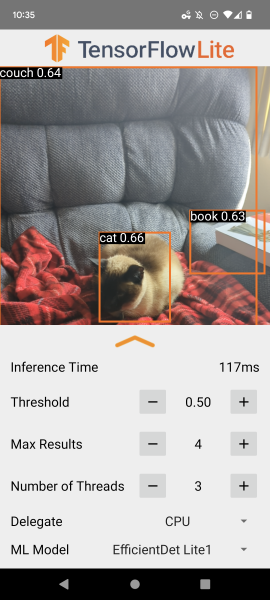

### This is my final year B.Tech. project 
### Introduction

In this project, we have developed an innovative educational tool that lever- ages the latest technologies to help children with reading disabilities develop critical reading skills. This android application uses augmented reality and artificial intelligence. This app offers a range of features that help children learn to read by providing them with interactive and engaging tools that enhance their learning experience.
The user can scan typed text from the app or type the text that they would like to process. The app provides synonyms and meanings of the word, help- ing to build their vocabulary and comprehension skills. In addition, the app identifies the part of speech for each word, helping children understand the grammatical structure of sentences.
To assist with reading fluency, the app also reads aloud the text, allowing children to listen to the words as they read along. This feature is particularly useful for children who struggle with reading, as it helps them develop their reading skills and build confidence in their abilities. Another feature of the
13
CHAPTER 4. PROPOSED WORK 14
app is the reading tracker, which helps children trace the text as it is read. This tool is particularly helpful for children with visual processing difficul- ties, as it enables them to focus on individual words and track their progress as they read. Images are generated for a word using AI, giving children a visual representation of the word they are learning.
Finally, the app includes an augmented reality component, allowing users to view 3D models of objects in their own space. This feature is particularly useful for children who learn best through visual and tactile experiences, as it provides a hands-on learning experience that enhances their understanding of the world around them.

### Overview

This is a camera app that continuously detects the objects (bounding boxes and
classes) in the frames seen by your device's back camera, with the option to use
a quantized
[MobileNet SSD](https://tfhub.dev/tensorflow/lite-model/ssd_mobilenet_v1/1/metadata/2),
[EfficientDet Lite 0](https://tfhub.dev/tensorflow/lite-model/efficientdet/lite0/detection/metadata/1),
[EfficientDet Lite1](https://tfhub.dev/tensorflow/lite-model/efficientdet/lite1/detection/metadata/1),
or
[EfficientDet Lite2](https://tfhub.dev/tensorflow/lite-model/efficientdet/lite2/detection/metadata/1)
model trained on the [COCO dataset](http://cocodataset.org/). These instructions
walk you through building and running the demo on an Android device.

The model files are downloaded via Gradle scripts when you build and run the
app. You don't need to do any steps to download TFLite models into the project
explicitly.

This application should be run on a physical Android device.

## Build the demo using Android Studio

### Prerequisites

*   The **[Android Studio](https://developer.android.com/studio/index.html)**
    IDE. This sample has been tested on Android Studio Bumblebee.

*   A physical Android device with a minimum OS version of SDK 24 (Android 7.0 -
    Nougat) with developer mode enabled. The process of enabling developer mode
    may vary by device.

### Building

*   Open Android Studio. From the Welcome screen, select Open an existing
    Android Studio project.

*   From the Open File or Project window that appears, navigate to and select
    the tensorflow-lite/examples/object_detection/android directory. Click OK.

*   If it asks you to do a Gradle Sync, click OK.

*   With your Android device connected to your computer and developer mode
    enabled, click on the green Run arrow in Android Studio.

### Models used

Downloading, extraction, and placing the models into the assets folder is
managed automatically by the download.gradle file.
